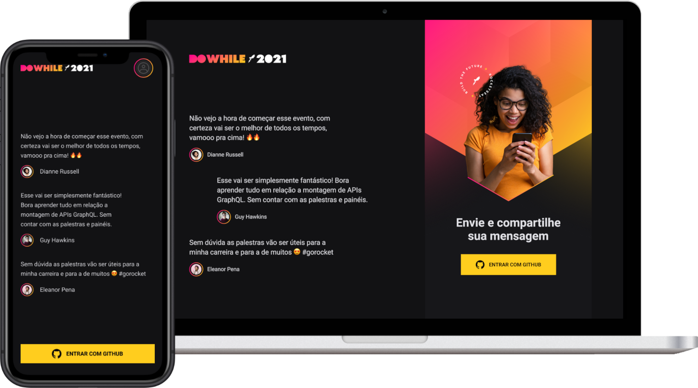

   

	

   

   

   <a aria-label="Completed" href="https://rocketseat.com.br/">
      </img>
   </a>

   

Esta é uma aplicação completa (front e back-end), desenvolvida durante o Next Level Week. Seu objtivo é a realização do cadastro e exibição em tempo real de mensagens relacionadas ao evento DoWhile 2021, da [Rocketseat](https://www.rocketseat.com.br/). 

  <a href="./frontend">💻 Aplicação Web</a>&nbsp;&nbsp;&nbsp;|&nbsp;&nbsp;&nbsp;
  <a href="./mobile">📱Mobile</a>&nbsp;&nbsp;&nbsp;|&nbsp;&nbsp;&nbsp;
  <a href="./backend">🗄️ Back-end</a>&nbsp;&nbsp;&nbsp;

## 🚀 Tecnologias

Neste projeto foram utilizadas as seguintes tecnologias:

- Typescript
- React/React Native
- NodeJS
- WebSocket
- Prisma

## 📷 Preview 

  

