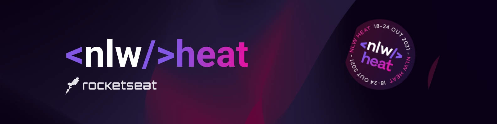
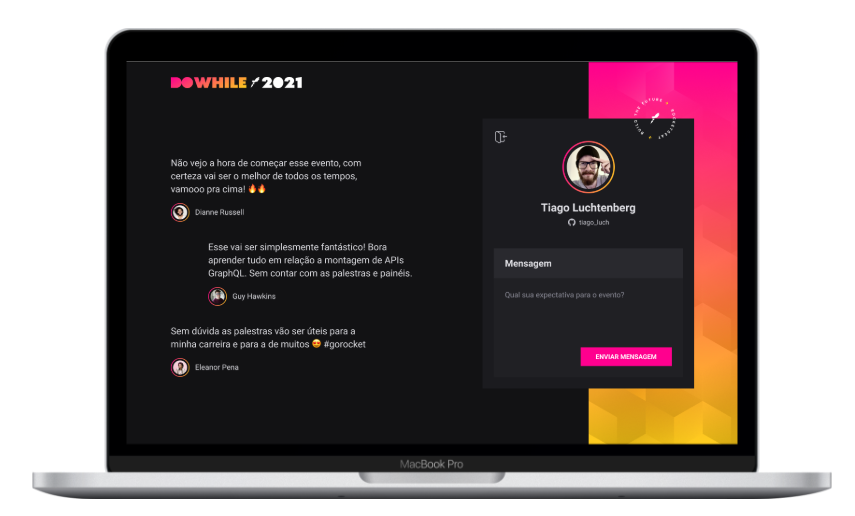

<p align="center">
   
</p>

   <a href="./README_pt.md">
      
   </a>

This repository stores the front-end of the application, developed in ReactJS using [Vite](https://vitejs.dev/) to build the project. 


### ✨ How to Use
- Clone the repository
    ```shell 
    git clone <url> 
    ```

- Install dependencies 

    ```shell 
    yarn 
    ```
- Start the project 

    ```bash 
    yarn dev
    ```

### 🚀 Technologies 

- [Vite](https://vitejs.dev/)
- [ReactJS](https://pt-br.reactjs.org/)
- [Typescript](https://www.typescriptlang.org/)
- [SASS](https://sass-lang.com/)
- [Axios](https://github.com/axios/axios)
- [Socket.io](https://socket.io/)

## 📷 Preview 
<div align="center">
  
</div>