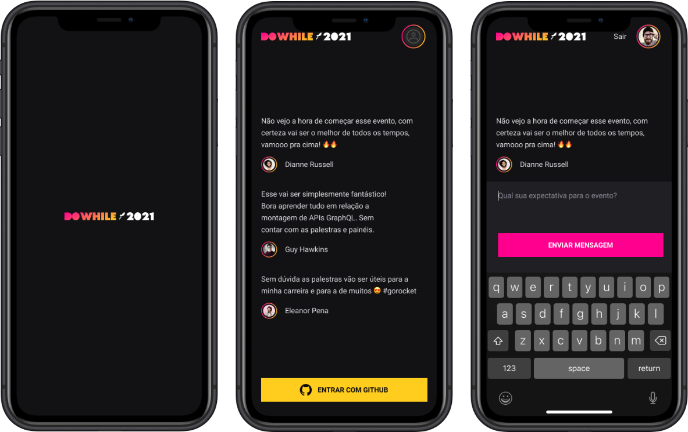

<p align="center">
   
</p>

<a href="./README_pt.md">
    
</a>

A aplicação mobile foi desenvolvida com React Native, utilizando [Expo](https://expo.dev/) para criação do projeto.

### Requisitos para Inicialização

```bash
npm install --global expo-cli
```

### Inicialização do Projeto

- Clone do repositório da pasta /reactnative

    ```bash
    npm install --global expo-cli
    ```

- Instalação de dependências

    ```bash
    yarn
    ```

## 🚀 Tecnologias

- Expo
- React Native
- Typescript
- Moti
- Axios

## 📷 Preview 
<div align="center">
  
</div>